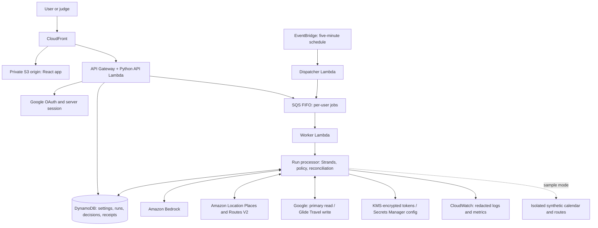

# Glide — implementation and submission plan

> Status, 14 September 2026: this is the original implementation plan, kept for
> the record. The shipped build and the measured evidence are in
> [README.md](README.md) and [docs/evaluation.md](docs/evaluation.md); the
> unchecked boxes in section 19 are the planning-time checklist, not the
> current release status. See
> [submission/release-checklist.md](submission/release-checklist.md).

Planning date: 8 September 2026. Status: ready for implementation handoff; the product and submission artifacts still need to be built and verified.

## 1. Product and decisions

**Name: Glide. Track: Everyday Agents.**

Glide reads a person's calendar, calculates travel time between physical appointments, and automatically reserves that time in their calendar. It keeps those blocks up to date when appointments change and asks for a decision when a journey cannot fit.

Preserve this core idea. The first audience is people who drive between several commitments in a day: busy parents, professionals, and field representatives. Demonstrate one person's mixed personal/work day to maintain the Everyday Agents positioning.

**Tagline:** Your calendar, with time to get there.

**Short pitch, below 175 characters:**

> Glide reads your Google Calendar, adds driving-time buffers between appointments, and flags impossible schedules so you can focus on your day.

The distinctive behavior is ongoing maintenance: create, update, and remove travel blocks as the day changes, then explain the exceptions. The submission must demonstrate this complete loop.

### Confirmed by the user

- Keep Glide's name and calendar/travel-buffer idea.
- Use Google Calendar.
- Prioritize driving. Walking, public transport, comparisons, and preferences may follow.
- Credentials are not available yet; the user can provide access for testing when needed.
- Produce a full plan for implementation agents, including submission work.

### Implementation defaults

| Decision | Default and reason |
| --- | --- |
| Calendar coverage | Read the primary Google calendar; write to a separate app-created **Glide Travel** calendar. |
| Travel mode | Driving only initially. Store a preference field and display only implemented modes. |
| Routing | Amazon Location Service Places and Routes V2, keeping model use and routing under AWS. |
| Arrival padding | Configurable, initially 10 minutes; validate a 0–60 minute range. |
| Planning window | Now through the next 48 hours, displayed in the user's chosen IANA time zone. |
| Background checks | Every five minutes while enabled; optional P1 near-term traffic refresh at most every 15 minutes. |
| Product interface | Responsive web app: day timeline, decisions, activity, and settings. |
| Agent | One Python Strands agent using Amazon Bedrock and typed tools. |
| Hosting | AWS serverless application; early AgentCore test with direct Lambda execution as the defined fallback. |
| Judge access | Isolated sample-day mode using the real Strands workflow and clearly simulated calendar/routing adapters. Prove real integrations separately in the video. |
| License | MIT, using the actual owner's name before publication. |

These are implementation defaults, not claims that integration works or that cloud spending is approved. Record any later changes in `docs/decisions.md` and update dependent contracts.

### Improvements to the original plan

1. Commit to one calendar and one travel mode for the deadline.
2. Prefer Amazon Location for routing. Keep a provider interface so Google Routes can be substituted if the early AWS coverage/access test fails; do not implement both.
3. Replace proposed “locked” blocks with ordinary private, busy events that Glide owns. Users can edit them, and Glide must respect that.
4. Define background execution explicitly: Strands runs the agent loop; scheduler, queue, storage, and application code provide scheduling and recovery.
5. Keep conflict resolution inside the first release's permissions: correct a location, skip a journey, or edit an original appointment in Google and recheck.
6. Prove live Google read/write, routing, and model access early.
7. Include the complete judge experience, submission content, deployment/run instructions, and acceptance evidence.

## 2. Scope

### P0 — required for the intended submission

- Google OAuth for the owner's test account.
- Read the primary calendar, handling pagination and individual recurring occurrences.
- Create/reuse the app-created Glide Travel calendar.
- Onboarding: time zone, starting address or “ask when needed,” earliest departure, driving, arrival padding, and explicit enablement of automatic travel management.
- Resolve full addresses and confirmed aliases; ask about ambiguous locations.
- Calculate driving time and insert feasible travel blocks.
- Update/delete only untouched future Glide-owned blocks when source events change.
- Explain conflicts with available time, required time, and shortfall.
- Resolve decisions through clarification, skip, or a source-calendar edit followed by recheck.
- Background runs while the browser is closed, persistent activity, pause/resume, disconnect, and understandable errors.
- Public sample mode, real-integration recording, public source, setup, license, architecture export, story, and public video.

### P1 — after the core loop works

- AgentCore, if the early deployment test succeeds.
- Near-departure route refresh and a “leave by” estimate.
- Additional read calendars with explicit selection and appropriate scopes.
- One useful AWS Builder post and measured usability/evaluation results.

### P2 — cut first

- Walking/public transport and per-journey comparison.
- Browser push, email, SMS, native mobile apps.
- Maps, turn-by-turn navigation, ride booking, location tracking.
- Automatic rescheduling of original appointments or messages to attendees.
- Shared-family coordination, fleet optimization, other calendar providers.
- Runtime multi-agent orchestration, vector databases, conversational memory.

Driving remains the only selectable mode until another mode's routing, timing, transfers, geography, and errors are tested. Do not build three modes merely for a comparison screen.

## 3. User experience

### First use

1. Landing page offers **Try a sample day** and **Connect Google Calendar**.
2. Sample opens an explicitly fictional schedule. Connected mode explains read access and the separate travel calendar before OAuth.
3. Collect preferences and preview proposed blocks plus unresolved locations.
4. User enables automatic management once; ordinary permitted updates proceed without repeated approval.
5. Show the timeline, automation status, last successful check, and decisions.

### Main screens and controls

- **Today / Tomorrow:** appointments and visually distinct travel blocks, with local time-zone labeling.
- **Needs your decision:** unresolved location, overlap, manual-edit, and connection issues.
- **Activity:** factual receipts such as “Updated travel after appointment moved.”
- **Settings:** pause, buffer, start point, earliest departure, calendar coverage, and disconnect.
- **Recheck now:** queue a job and show its progress; this is not the only automation trigger.

Each block shows origin/destination labels, reserved time, driving mode, padding, estimate timestamp, and update status. Each conflict names the relevant commitments and gives a clear next step.

Actions: **Correct location**, **Skip this journey**, **Open appointment in Google Calendar**, **Recheck after edit**. Opening an event does not resolve the conflict; resolution requires a successful recheck or explicit skip.

Use a calm day timeline, clear typography, text/icons alongside status colors, visible keyboard focus, readable contrast, and usable mobile layouts at 390 px. Keep infrastructure and SDK traces out of the everyday interface.

Initial alerts are persistent in-app decisions. Background calendar updates continue while the browser is closed, but the MVP does not promise external notifications. Disable reminders on new travel blocks by default.

## 4. Canonical demo scenario

Use fictional people and publicly identifiable real venues for the live test. Keep separate synthetic routes for repeatable tests; fixture values must not be described as live provider results.

| Commitment | Time | Place |
| --- | --- | --- |
| Client visit | 09:00–10:00 | A |
| Appointment | 11:00–11:30 | B |
| School pickup | 12:00–12:15 | C |

Fixture: A→B takes 25 minutes; B→C takes 30; padding is 10.

1. Start with no travel blocks; enable Glide.
2. A→B fits at 10:25–11:00, including padding. Show the new block.
3. B→C requires 40 minutes with only 30 available: show a 10-minute shortfall, with no overlapping block.
4. Move the middle appointment to 10:45–11:15 in the source calendar.
5. Recheck: first block becomes 10:10–10:45; B→C now fits at 11:20–12:00; conflict resolves.
6. Repeat the check: no duplicates.
7. Delete the middle appointment: remove its obsolete block and recalculate the following direct A→C journey.

For the live recording, obtain actual route durations first and choose event gaps that create a visible feasible journey and conflict. Show those actual values. Do not force live APIs to match fixtures. Label any edited-out waiting period.

## 5. Calendar and travel behavior contract

### Input rules

- MVP covers the primary calendar only; state this in onboarding and README. A busy event on the separate travel calendar is a visible reservation, not a guarantee that another booking tool will include it when checking primary-calendar availability.
- Use a bounded rolling window, `singleEvents=true`, pagination, UTC normalization, and original IANA zones for display. Expand recurring instances through Google.
- Canceled/declined events do not generate travel or busy intervals. Respect transparent/free events.
- Online meetings create no destination but opaque meetings occupy time. Hybrid/uncertain meetings need a user choice.
- Opaque all-day events produce one day-level decision instead of treating the day as freely schedulable. Transparent all-day events generate no travel.
- A timed event with no usable location still occupies time. If it could change the person's origin, suspend affected downstream journeys for clarification.
- Matching confirmed place IDs mean no inter-event travel. Similar names alone do not prove the same location.
- First physical event uses the confirmed starting address and earliest departure; otherwise ask once. Do not assume live location, overnight journeys, or a return home.
- Virtual commitments between physical stops leave the assumed location unchanged but occupy time. Find a contiguous free interval; never schedule driving during the online meeting.
- Overlapping physical appointments or an unresolved journey can invalidate the downstream origin. Flag the affected chain until a confirmed anchor or user decision restores a coherent itinerary; do not silently assume the person completed an impossible journey.

### Time calculation

Let `arrival_target = destination.start - padding`. Request an arrival-aware estimate where supported, then compute `departure = arrival_target - duration`. Reserve `[departure, destination.start)`, including padding. Half-open intervals allow touching boundaries.

The interval must start after the origin is available, respect earliest departure, avoid every included busy interval, and not start in the past. Origin/destination must be known, mode supported, and the provider response valid.

If an intervening busy event prevents the latest-arrival interval, examine earlier free gaps in reverse order after the origin becomes available. Estimate travel at the earlier departure and reserve driving plus padding; show any wait before the destination separately.

If arrival-aware routing is unavailable, use at most three departure-time estimates and validate the resulting arrival. If none fits, return a conflict/unavailable result. The model never invents coordinates, duration, or feasibility.

When P1 traffic refresh is enabled, it covers departures within two hours, at most once per 15 minutes. Update for a material duration change of at least two minutes. P0 always recalculates affected journeys after a source-event change. Any newly infeasible journey creates a decision even below that threshold. This is bounded polling, not continuous traffic monitoring or guaranteed punctuality.

### Ownership and reconciliation

- Create ordinary private busy events titled `Travel · Glide`, with no attendees, conferencing, or default reminders. Optional destination detail belongs in a private description.
- Store private properties identifying Glide, user, journey key, destination occurrence, and schema version.
- `journey_key = hash(user_id, source_calendar_id, destination_occurrence_id, mode)`. Origin/times are mutable values, not identity; preserve recurrence occurrence identity across moves.
- Derive a Google-compatible deterministic event ID. On uncertain insert success or existing-ID response, fetch that ID and reconcile.
- Own a block only when the database mapping and private marker agree. Never adopt/delete by title.
- Record source revisions and managed event ETags. Re-read source dependencies immediately before mutation; stale plans requeue. Existing updates/deletes use conditional requests.
- A user-edited managed block creates a decision: keep their version and suspend management, or rebuild with permission. A manual deletion becomes a skip for that occurrence; never immediately recreate it.
- Cancellation removes only untouched future managed blocks. Recompute following journeys whose origin changed. Never modify past/already-started travel.
- Deduplicate decisions by occurrence and relevant revision. Reopen only after meaningful source changes; identical polls must not repeat alerts.
- Pause prevents new writes. Disconnect disables jobs, offers cleanup before revocation, then deletes/revokes credentials. If cleanup fails, explain that the separate calendar can be removed manually.

Google offers no transaction spanning source and travel calendars. Revalidation and conditional writes reduce races; document the small remaining change-between-check-and-write window.

## 6. Strands agent and execution boundaries

Use one Strands agent for interpreting uncertain context, selecting place lookup/clarification, requesting routes, and proposing evidence-backed actions. Deterministic code owns arithmetic, permissions, conflict checks, and writes.

Demonstrate a meaningful tool sequence: inspect a changed day, resolve a known alias or request clarification, obtain the correct timed route, evaluate feasibility, and emit a structured proposal with a concise explanation.

| Tool | Input | Result/boundary |
| --- | --- | --- |
| `read_schedule` | Server-bound run/window | Minimized normalized events and busy intervals; identity is not model-controlled. |
| `lookup_place` | Bounded location text/region | Up to three candidates or a confirmed alias. |
| `estimate_journey` | Known place references, time, mode | Provider-backed estimate or typed unavailable response. |
| `evaluate_candidate` | Event/route references | Deterministic interval or quantified conflict. |
| `request_decision` | Reason and validated evidence | Durable deduplicated user decision. |
| `propose_plan` | Typed actions/evidence | Proposal for validation; grants no write authority. |

The executor is application code, not a generic calendar-write tool. It reloads identity/policy, validates references and source revisions, performs allowed changes, and records receipts. No model-generated user ID, permission, or calendar ID can broaden access.

Treat calendar titles/locations as untrusted data. Omit attendees, attachments, tokens, and full descriptions by default. Limit and delimit source text. Provide no shell, arbitrary HTTP, or unrestricted mutation tools.

Persist decisions in the application database. Answers trigger a fresh bounded run against current events. Native Strands interrupts are optional, not a requirement to keep a process alive while waiting; if used, persist their state and retain server authorization. [Strands interrupts](https://strandsagents.com/docs/user-guide/concepts/interrupts/)

Use typed output schemas and reject unknown references. Allow one schema-repair retry. Initial configurable limits: 20 relevant timed events, 10 journeys, 30 route calls including timing retries, 10 model turns, and a 120-second application deadline. Exceeding scope produces an explicit decision, not silent partial success.

Log tool names, durations, safe reason codes, hashes, usage, and receipts. Show factual user explanations rather than hidden model reasoning or raw personal traces. Strands supplies the model/tool loop, not periodic scheduling. [Strands agent loop](https://strandsagents.com/docs/user-guide/concepts/agents/agent-loop/)

## 7. Architecture and stack



The diagram shows the required Lambda fallback. If the AgentCore test succeeds, the worker invokes the same run processor in AgentCore instead of locally. The final diagram must show the actual deployed choice.

| Component | Choice |
| --- | --- |
| Backend | Python 3.12, FastAPI, Pydantic, Mangum for API Lambda, `uv` lockfile. |
| Agent/model | `strands-agents`, Bedrock provider, configurable model ID. Start with a tool-capable Amazon Nova model available in the account; record the exact model after access and quality tests. |
| Google | Calendar API V3 and maintained Google auth clients; server-side OAuth web flow. |
| Routing | Boto3 `geo-places` and `geo-routes` clients, current V2 operations. |
| Web | React, TypeScript, Vite, ordinary CSS/accessibility; no map required. |
| Storage | DynamoDB on demand in AWS; SQLite adapter for local/sample development. Lambda disk is never durable state. |
| Infrastructure | AWS SAM for the base application; separate explicit AgentCore deployment/config if used. |
| Validation | Pytest, TypeScript checks, production frontend build, focused Playwright journeys. |

Select a region after testing Bedrock model access and Amazon Location together; `eu-west-1` is a candidate, not a verified account setup. Pin tested dependencies. Do not publish guessed model IDs or untested deployment commands.

### Background operation

- API returns `202` and run ID for checks. Automatic, manual, and decision-triggered work all enters the same queue.
- One FIFO message group per user; database lease with revision/fencing checks. API handlers never independently mutate calendars.
- Batch size one; worker timeout above the application deadline; queue visibility comfortably above worker timeout; bounded retries and dead-letter queue. Repeated delivery must be harmless.
- Scheduler queries indexed active/due users in bounded batches. Full rolling-window polling is the MVP.
- Fingerprint unchanged source data before model invocation, while maintaining a separate near-departure route-refresh clock.
- Do not combine moving window filters with incremental sync tokens. Push subscriptions/incremental sync are later work.
- Persist successful receipts before completing a run. A crashed worker retries remaining work by reconciliation, not blind replay.

### AgentCore gate

Time-box a real deploy/invoke experiment to two hours on 9 September after a local run works. Use current Python direct-code deployment, appropriate runtime role, and external persistent state. The worker passes an authorized run reference; the processor loads state itself.

Pass only when deployed execution reads state, uses model/tools, persists a result, and produces inspectable logs. Otherwise run directly in Lambda and remove AgentCore claims/tags. UI, jobs, and domain behavior remain the same. [AgentCore Python deployment](https://docs.aws.amazon.com/bedrock-agentcore/latest/devguide/runtime-get-started-code-deploy-python.html)

## 8. Data and API contracts

The lead creates schemas before delegating modules. Commit OpenAPI and corresponding frontend types. Contract changes require updating both and notifying downstream workers.

| Record | Required fields |
| --- | --- |
| `UserSettings` | User ID, IANA time zone, source/Glide calendar IDs, confirmed start-place reference, earliest departure, mode, padding, enabled flag, revision. |
| `CalendarEvent` | Provider and occurrence IDs, calendar ID, ETag, start/end UTC, original zone, title, location, status, transparency, attendance, physical/virtual/unknown classification. |
| `PlaceRef` | Internal/provider IDs, confirmed label and coordinates where permitted, provenance, confirmation and storage-policy status. |
| `RouteEstimate` | Run-local ID, place references, mode, timing constraint, duration seconds, provider, timestamp, quality/availability flags. |
| `JourneyPlan` | Journey key, source references/revisions, route reference, proposed interval, padding, action `create/update/remove/noop/decision/skip`, reason code. |
| `ManagedBlock` | Journey key, Google event ID, last applied hash, ETag, source/policy revisions, manual override/skip status. |
| `Decision` | ID, user, occurrence/journey, source revision, reason, calculated facts, allowed actions, status, version. |
| `Run` | ID, user, trigger, status, lease revision, source fingerprint, start/end, counts, safe failure code. |
| `MutationReceipt` | ID, run/journey, operation, provider event ID, before/after hashes, outcome, timestamp. |

Run states: `queued → reading → planning → applying → completed`; alternatives: `needs_input`, `failed`, `superseded`, `paused`. Partial receipts survive failure. Decisions have independent `open/resolved/dismissed/stale` states.

| Endpoint | Purpose |
| --- | --- |
| `GET /api/auth/google/start`, `GET /api/auth/google/callback` | OAuth and verified server session. |
| `POST /api/demo/session` | Create an isolated synthetic tenant and session. |
| `GET /api/me`, `PATCH /api/settings` | User/preferences with revision checks. |
| `GET /api/day?date=YYYY-MM-DD` | Events, travel, coverage, decisions, status. |
| `POST /api/runs`, `GET /api/runs/{id}` | Queue/poll a check. |
| `GET /api/decisions`, `POST /api/decisions/{id}/resolve` | Read/resolve against decision version. |
| `GET /api/activity` | User-visible receipts. |
| `POST /api/pause`, `POST /api/resume` | Automation controls. |
| `POST /api/disconnect` | Disable work, optional cleanup, token revocation/deletion. |
| `PATCH /api/demo/events/{id}` | Edit source fixture times/location in the current synthetic tenant only. |
| `POST /api/demo/reset` | Reset only the current synthetic tenant. |
| `GET /api/health` | Non-sensitive health, without account diagnostics. |

Never trust a body-supplied user ID. Derive identity from the server session, enforce ownership on every reference, and require CSRF/known-origin checks for mutations. Use idempotency keys for repeatable actions. Return clear authentication, conflict, throttling, and provider-unavailable errors without exposing credentials.

## 9. Credentials, live tests, and cost

### Owner setup needed at implementation start

1. AWS account/profile with permission for the selected Bedrock model, Amazon Location, and chosen deployment resources. Use temporary credentials/local profiles; do not paste keys into chat.
2. Google Cloud project with Calendar API enabled, OAuth consent configured, and web client using exact local/deployed redirect URLs.
3. Owner's designated Google account added as a test user; fictional appointments for testing and recording.
4. OAuth configuration supplied through an ignored local file or secret store.
5. Confirm a cash spending cap before billable tests/resources. Design target: a small demo within the advertised $50 AWS credit; credits, pricing, and account approval remain unverified.
6. Request credits by **11 September, 20:00 BST / 12:00 PDT**, if desired and available.

Proposed Google scopes: `openid`, `email`, `https://www.googleapis.com/auth/calendar.events.readonly`, and `https://www.googleapis.com/auth/calendar.app.created`. Read only primary in application code; write only the saved app-created calendar. Verify scope/method compatibility in the first read/create/update/delete test. Do not silently expand to full calendar control. [Google Calendar scopes](https://developers.google.com/workspace/calendar/api/auth)

OAuth requires browser-bound state, one-time callback consumption, exact redirects, server-side code exchange, identity-token issuer/audience/expiry validation, and expiring secure HttpOnly SameSite session cookies. Request offline access; handle denied/revoked/expired consent. Encrypt refresh tokens with KMS and user-bound context; keep application secrets in Secrets Manager. Lead owns auth.

Google external apps in Testing can receive refresh tokens that expire after seven days. Do not assume a connection made during build survives judging. Provide reconnect behavior and a judge path independent of Google consent verification. Owner test access does not prove public onboarding is approved. [Google OAuth lifetime](https://developers.google.com/identity/protocols/oauth2)

Amazon Location uses Places lookup and Routes `CalculateRoutes` with explicit timing, `Car` mode, and traffic settings. Validate exact request/response fields in the installed SDK; coordinates are longitude then latitude. Test the actual demo city. [Routes V2 reference](https://docs.aws.amazon.com/location/latest/APIReference/API_CalculateRoutes.html)

For persisted place results/aliases, use supported `IntendedUse=Storage` and account for its pricing. Avoid storing raw route payloads or geometry; retain permitted application scheduling state/evidence only. Include applicable attribution and privacy/terms pages. [Places intended use](https://docs.aws.amazon.com/location/latest/developerguide/places-intended-use.html)

If AWS routing fails the early test, lead may switch to Google Routes `computeRoutes`, with separate billing, restrictions, and attribution/storage handling. This is a fallback, not a second MVP provider. [Google Routes](https://developers.google.com/maps/documentation/routes/compute_route_directions), [policies](https://developers.google.com/maps/documentation/routes/policies)

### First live proof, due 9 September

- Read fictional source events from Google.
- Create, fetch, conditionally update, and delete one owned travel event.
- Reconnect and reuse the same travel calendar.
- Invoke Bedrock through Strands and observe a real tool call.
- Resolve a real place and request a real timed driving route.
- Record results/redacted evidence and exact tested versions; no secret-bearing screenshots.

Missing credentials do not prevent schemas, fixture adapters, UI, timing, and offline tests. They do prevent calling a live integration complete.

## 10. Deployment and operations

- Private S3 behind CloudFront; `/api/*` routes to API Gateway with caching disabled and appropriate cookie/query forwarding. Browser sessions use the same public origin.
- Keep provider calls/keys server-side with resource-scoped roles. Synthetic tenants can never access live Google tokens.
- Separate local and deployed configuration. Ignore tokens, local databases, private exports, personal recordings, and `.env`.
- Store minimal active 48-hour snapshots; remove outdated snapshots within 24 hours after they leave the window. Redacted receipts: seven days. Synthetic sessions: 24 hours.
- Delete credentials on disconnect; enforce expiration during reads because database TTL cleanup is asynchronous. Document any backup/log retention.
- Provider failure creates an unavailable/stale status and no inferred writes. Preserve existing blocks until a successful check can reconcile them.
- Backoff/jitter for transient failures; invalid credentials pause the connection and create one reconnect decision. Repeated failures reach a dead-letter queue.
- Record usage; set owner-approved cost alerts, concurrency quotas, and application limits. Budget alerts are not hard spending caps.
- Public sample accepts controlled scenario edits, not arbitrary prompts, URLs, or destinations. Isolate users and protect anonymous session creation; provide separate judge access if public throttling is reached.
- Maintain free working test access through **9 October 2026, 01:00 BST / 8 October, 17:00 PDT**, the end of judging. English submission materials and working-project access are required by the [official rules](https://agentsforhumans.devpost.com/rules).

Public sample mode executes real Strands and the executor against isolated synthetic providers; label **Sample calendar · simulated routes**. Local offline tests may stub the model, but must not be presented as a live agent demonstration. The video proves real Google, AWS routing, and model use separately.

## 11. Repository layout

Preserve the five hackathon reference documents. This plan is the implementation source of truth until actual documentation records the shipped behavior.

```text
README.md
LICENSE
.env.example
.gitignore
pyproject.toml
uv.lock
backend/glide/
  api/                  # routes, auth, sessions
  domain/               # schemas, timing, policy, reconciliation
  agent/                # Strands agent, prompts, typed tools
  adapters/             # Google, AWS Location, storage, fixtures
  jobs/                 # dispatcher, worker, recovery
frontend/
  src/                  # screens, components, API types
  package.json
  package-lock.json
infra/
  template.yaml         # SAM base stack
  agentcore/            # only if used
scripts/                # local seed, validation, packaging
tests/
  unit/
  integration/
  e2e/
  fixtures/
docs/
  architecture.md
  architecture.png
  setup.md
  decisions.md
  privacy.md
  third-party-notices.md
  evaluation.md
submission/
  devpost-story.md
  fields.md
  testing-instructions.md
  demo-script.md
  screenshots/
  builder-post.md
  release-checklist.md
```

These are required future artifacts, not files claimed to exist. Keep real owner identifiers and any private judge credentials out of public source where appropriate.

## 12. Subagent work orders

Lead owns requirements, architecture, contracts, auth, concurrency, mutation safety, debugging, integration decisions, and final review. Follow AGENTS.md: **only one write-capable worker at a time**; parallel work is limited to independent read-only corpora.

Each task must provide exact paths, relevant plan sections, dependencies, acceptance checks, and a representative file where available. Tell workers they share the codebase, must not revert others, and must stay within ownership. Lead creates the first adapter/component before using `pattern_writer` for predictable follow-on scaffolding.

| Task / owner | File ownership and responsibility | Dependencies | Acceptance |
| --- | --- | --- | --- |
| L0 — lead | Root setup, frozen schemas, synthetic calendar/model fixtures, representative adapter/component, `domain/` contracts. | Can start without credentials. | Fixture loads; timing examples executable; API types agree. |
| L1 — lead | `api/` auth/session/security, credential store, policy and fencing design. | L0; live access for verification. | OAuth failure paths, tenant isolation, CSRF, restricted writes, retry policy. |
| W1 — integration worker | `adapters/google_calendar.py` and focused tests; consume lead's auth interface. | L0/L1; Google test account. | Paging/instances; create/read/conditional update/delete; calendar reuse. No scope widening. |
| W2 — integration worker | `adapters/amazon_location.py`, fixture routes, focused tests. | L0; AWS access. | Place→timed route; ambiguity, no-route, throttling, storage settings. |
| L2 — lead | `domain/`, `jobs/`, storage adapters, and non-auth API routes: arithmetic, reconciliation, persistence, leases, stale plans, recovery; associated behavioral tests. | W1/W2 interfaces; fixtures first. | Full maintenance loop; no-op rerun; source appointments untouched. |
| W3 — agent worker | `agent/` and scenario tests using frozen domain APIs. | Tool contracts and adapters. | Real tool sequence, evidence-backed proposal, safe failure behavior. |
| W4 — UI worker | `frontend/src/` and UI tests, using lead's types/component reference. | API types and fixture server. | Onboarding, timeline, decisions, source fixture edits, controls, mobile/keyboard. |
| L3 — lead | `infra/`, deployment/packaging scripts, CI, operations, AgentCore experiment. | Local skeleton for early experiment; integrated path for release; access and budget. | Public HTTPS sample; browser-closed scheduled run; redacted logs. |
| W5 — documentation worker | Final `README.md`, `docs/` and `submission/` except lead-reserved files. | Actual build/evidence; lead transfers README ownership. | Reproducible setup, exported diagram, truthful story/script/field inventory. |
| V1 — test runner | Run established checks; report status and decisive failures only. | Integrated candidate. | Appropriate tests/build pass or focused failures returned to lead. |
| L4 — lead + owner | Final review, real accounts/URLs, recording/publication, Devpost receipt. | P0 gates and owner fields. | Assets consistent/accessible; submission received on time. |

Workers return files changed, concise behavior summary, check results, remaining issues, and requested contract changes. A module passing its checks does not establish that the release is complete.

## 13. Delivery calendar

All working dates use **Europe/London (BST)**. Fixed timestamps take precedence over old “6 days remaining” snapshots.

| Date | Required result |
| --- | --- |
| **8 September, tonight** | Plan, account requests, scope/contracts, skeleton, fixture day. |
| **9 September** | Live Google CRUD/reconnect, Bedrock tool call, real route, basic timeline; two-hour AgentCore experiment. |
| **10 September** | Background read→reason→validate→insert, persistent state, no-op repeat. |
| **11 September** | Move/cancel reconciliation, decisions, manual overrides, connection lifecycle. Credits request before 20:00 if wanted. |
| **12 September** | Public sample, browser-closed scheduled run, meaningful tests, two or three usability sessions if available. Freeze new features that evening. |
| **13 September** | Release candidate, clean setup trial, diagram, story, first complete recording, screenshots, optional Builder post. |
| **14 September by 12:00** | Final public video, real URLs/fields, signed-out judge access checks. |
| **14 September by 18:00** | Submit and capture receipt; seven-hour contingency remains. |
| **15 September 01:00** | Hard deadline: 14 September 17:00 PDT / 15 September 00:00 UTC. |
| **Through 9 October 01:00** | Maintain the submitted working test experience and monitor access. |

If credentials are missing on 9 September, continue fixtures but immediately flag live proof as blocked by access. If still unavailable on 12 September, state that intended P0 delivery is at risk and prioritize access over polish.

Cut order: extra modes, maps, notifications, additional calendars, extra blog posts, AgentCore if its test fails. Preserve live Google/Strands, background processing, reconciliation, conflicts, and mandatory artifacts.

## 14. Verification and evidence

These are acceptance targets, not achieved results. Test behaviors that can corrupt calendar state or break the user journey.

| Area | Cases and expected behavior |
| --- | --- |
| Time arithmetic | Padding, exact boundary, insufficient gap, first event, same place, past departure, intervening virtual event, no contiguous slot, midnight and DST. Only feasible intervals are written. |
| Normalization | Pagination, moved/canceled recurring instance, declined/transparent/all-day events, missing location. Correct occurrences and busy intervals. |
| Reconciliation | Repeat run, timeout after successful insert, moved/canceled event, manual edit/deletion, orphan block, ETag failure. No duplicates or unauthorized changes. |
| Recovery | Duplicate job, expired lease, stale revision, crash after one write, settings change during run. Stale workers cannot commit; retries reconcile receipts. |
| Decisions | Ambiguous place, unknown origin, corrected conflict, stale answer, skip plus repeated poll. One understandable decision; no stale action. |
| Security | Cross-user IDs, forged callback, CSRF, denied scope, revoked token, prompt injection in event text. No unauthorized access, tools, or secret logs. |
| Live providers | Google read/write, Amazon Location route, Bedrock Strands call, provider errors. Record real results without private data. |
| UI/end-to-end | New sample→block→conflict→source edit→reconciliation→reset; real connection, expired session, keyboard/mobile. Correct persisted outcomes. |
| Background | Close browser, edit a source event, observe the scheduled update within one polling interval plus processing time. Capture timestamps. |
| Release | Clean checkout/setup, typecheck/build, signed-out repo/license/diagram/video access, fresh-browser judge path. |

Create 12–20 small labeled scenarios, including malicious event text and routing failure. Separate offline deterministic checks from live-model evaluation. Compare allowed actions, evidence, reason codes, and final calendar state rather than exact prose.

Release targets:

- Zero source-appointment edits or writes without enabled policy.
- Zero duplicate blocks in repeat/retry scenarios.
- All deterministic scheduling/reconciliation cases pass.
- Ten consecutive canonical integrated runs succeed; identify which used live providers. Report failures rather than excluding them.
- Sample-run target below 60 seconds; background target within one five-minute interval plus processing. Report measured latency, not a fabricated percentile.
- At least two unfamiliar testers can understand and resolve a conflict without verbal help, if testers are available. Record actual observations.

Measure manual checking time on the same sample day versus Glide, decisions required, blocks created/updated, duplicates, latency, provider calls, and estimated cost. Time-saving claims must state method/sample size. Do not invent hours saved per week or general punctuality improvements.

Document exact runnable checks in setup and CI. Expected commands include `uv sync --frozen`, `uv run pytest`, and frontend `npm ci`, typecheck, and production-build scripts. Do not claim undefined/unrun commands passed.

## 15. Submission coverage and scoring

Local field/media sources: [Project Details Guide](PROJECT%20DETAILS%20GUIDE.md), [Submission Summary](SUBMISSION%20SUMMARY.md), [Rules Summary](RULES.md), [Hackathon Summary](SUMMARY.md). Current official rules prevail.

| Required item | Deliverable / owner | Ready when |
| --- | --- | --- |
| Entrant eligibility/profile | Owner: submitter type, residence, eligible team/org, authorized representative where applicable. | Checked against current age, territory, affiliation/conflict, and other eligibility rules. Do not infer residence from device time zone. |
| Overview | Glide, short pitch, Everyday Agents, thumbnail. | Correct name/track and form limits. |
| Project story | `submission/devpost-story.md`. | English account of audience, workflow, actual implementation, learning, limits, roadmap. |
| Built With | Actual technology tags, at most 25. | All tags correspond to the submitted build. |
| Public repository | Source/assets, setup, lockfiles, README, MIT LICENSE, notices/disclosures. | Loads signed out; license detected at repository top/About and linked in README. |
| Architecture | Editable source plus PNG/PDF export. | Actual deployed flow, accepted format, below 35 MB. |
| Video | Public YouTube/Vimeo URL, maximum five minutes. | Working demo plus problem, audience, and why it matters; public access verified. |
| AWS Builder ID | Owner's real identifier in Devpost. | Provided in correct field, never invented. |
| Working test access | Hosted sample/testing instructions plus real integration setup/test build. | Judges can evaluate without fees or arranging personal Google access. |
| Submit | All Devpost steps through Submit. | Receipt confirms submission rather than saved draft. |

Additional coverage:

- Live demo URL with accurate synthetic/live labels.
- Testing instructions; any private judge credentials only in organizer-facing fields.
- Gallery: four recommended screenshots, 3:2 ratio; JPG/PNG/GIF, below 5 MB each, maximum 15.
- Optional AWS Builder article with **Agents for Humans** in the title, public before the deadline. One strong post is the default.
- Organization/team details when relevant.
- Disclose incorporated pre-existing work and licenses; preserve provenance showing project work occurred during the submission window: 10 August 2026, 09:00 Pacific through 14 September, 17:00 Pacific.

| Criterion | Glide evidence |
| --- | --- |
| Technical implementation | Real Strands tools/providers, background jobs, structured output, replay-safe reconciliation, deployed demo; AgentCore only if shipped. |
| Design | Coherent onboarding→maintained calendar→understandable decisions. |
| Potential impact | Specific multi-stop day, genuine feedback, measured task comparison. |
| Creativity/originality | Maintained travel layer responding to schedule changes and respecting manual edits, with domain-specific edge cases. |
| Presentation | Actual calendar changes and conflict resolution, readable diagram, reproducible judge path. |

Strands is required; AgentCore is optional. Live demo/AgentCore can strengthen technical scoring. Optional Builder posts can add 0.2 each up to 0.6; do not sacrifice a working release to chase posts. Deadline and rules were checked on 8 September 2026. [Hackathon overview](https://agentsforhumans.devpost.com/), [official rules](https://agentsforhumans.devpost.com/rules)

## 16. Devpost story draft

**Publication gate:** the present-tense claims below require implementation evidence. Before publishing, remove unshipped features, replace placeholders with actual results/URLs, and describe real challenges and learning. This plan is not proof of completed work.

### Inspiration

Calendars record when commitments happen, but the journey between them often remains a mental calculation. On a day containing client visits, appointments, and school pickup, an empty gap can look available even when it is needed for driving. A change to one appointment means checking the day again.

We built Glide around a simple idea: the calendar should include the time needed to get there. The agent handles routine travel planning and brings the person back when information is missing or their schedule needs a decision.

### What it does

Glide connects to Google Calendar, reads upcoming appointments, and creates driving-time blocks in a separate Glide Travel calendar. It combines route estimates with the user's arrival buffer and checks that each journey fits around existing commitments.

When an appointment moves or disappears, Glide updates its travel blocks. When travel cannot fit, it explains the shortfall and lets the user correct a location, skip a journey, or edit the appointment and recheck. Users can pause automation and remain in control of their original appointments.

The first version focuses on driving and one source calendar. The hosted sample lets judges explore the workflow with fictional appointments and simulated routes; the video demonstrates the real Google Calendar and AWS integrations.

### How we built it

The Strands Agents SDK connects calendar context, place lookup, route estimation, and structured journey proposals through typed tools. Amazon Bedrock provides the model, and Amazon Location Service provides place and driving-route information. Deterministic application code validates time constraints and limits writes to Glide's own calendar events.

An AWS scheduler and durable queue keep the application checking while the browser is closed. Persistent state connects appointments to their travel blocks, allowing retries and schedule changes to be reconciled. A responsive interface shows the day's travel, decisions, and completed updates.

Before publishing, name the actual hosting choice and tested model. If AgentCore shipped, add one factual sentence explaining its role; otherwise omit it.

### Accomplishments

Replace this section with verified evidence: live workflow demonstrated, scenario results, retry/no-duplicate checks, and one usability observation. Include sample sizes; do not invent benefit claims.

### Challenges we ran into

Write two or three observed problems, the changes made, and the evidence that fixed them. Anticipated topics: OAuth test-token expiry, recurring-instance identity, ambiguous venues, estimates at the intended time, duplicate prevention after timeouts. These become reported challenges only if they actually occurred.

### What we learned

Use real implementation/tester observations. Assess how much reliable behavior depended on tool boundaries and persistent state. Do not claim user validation without user sessions.

### What's next for Glide

Extend the tested driving workflow to walking and public transport, add per-journey preferences where coverage supports them, and let users include additional calendars. Improve departure alerts after delivery testing and pursue the appropriate Google consent/verification process for public onboarding.

### Built With draft

`strands-agents-sdk`, `python`, `amazon-bedrock`, `amazon-location-service`, `google-calendar-api`, `aws-lambda`, `amazon-eventbridge`, `amazon-sqs`, `amazon-dynamodb`, `amazon-s3`, `amazon-cloudfront`, `amazon-api-gateway`, `react`, `typescript`, `fastapi`, `aws-sam`.

Add `amazon-bedrock-agentcore` only if used. Remove unused tags and choose corresponding tags available in Devpost.

## 17. Video, diagram, gallery, and Builder post

### Video script — target 4 minutes 30 seconds

| Time | Screen/action | Purpose |
| --- | --- | --- |
| 0:00–0:25 | Calendar with physical appointments and misleading gaps. | Introduce Glide, audience, repeated travel-checking work. |
| 0:25–0:50 | Driving, buffer, separate travel calendar, enable automation. | Explain delegation and user control. |
| 0:50–1:40 | Real Google calendar before/after an actual Strands run. | Show source read, real route, feasible block created. |
| 1:40–2:35 | Quantified conflict, edit original appointment, recalculated calendar. | Show a human decision and actual resolution. |
| 2:35–3:05 | Repeat run and source change/deletion; activity/block count. | Prove maintenance and no duplicates. |
| 3:05–3:35 | Background-run timestamps and architecture. | Explain actual Strands/AWS/scheduling/persistence roles. |
| 3:35–4:05 | Labeled sample experience and measured evaluation. | Explain judge access and actual findings. |
| 4:05–4:30 | Name, real repo/demo links, concise roadmap. | Restate benefit and current limits. |

Record a working release. No fabricated logs, fixture numbers described as live, UI success without actual mutation, or future features portrayed as shipped. Use captions/readable zoom. Include title/end cards in the five-minute limit. Video must be public, not merely unlisted.

### Architecture artifact

Export the deployed diagram to PNG and optionally PDF, preserving editable source. Show scheduler, agent/runtime, model, calendar permission boundaries, routing, persistent state, frontend/API, and synthetic mode. No secrets/account IDs or unshipped AgentCore component. Check readability and file size.

### Four gallery images

1. Timeline with original appointments and inserted travel.
2. Conflict with quantified shortfall and action.
3. Updated calendar and receipt after resolution.
4. Architecture or settings showing user-controlled policy.

Use actual screenshots, fictional personal data, captions, 3:2 framing, and format/size limits. AI-generated product mockups are unnecessary.

### Optional AWS Builder post

Suggested title: **Agents for Humans: Building Glide, a Calendar Agent That Makes Room for Travel**.

Outline: missing travel-time problem; first real Strands/calendar call; persistent scheduling state; routing and ambiguity; one actual bug/fix; deployment/evaluation; real demo/repo links. Clearly distinguish fixtures from live integrations.

Publish one useful post after the release works. Additional distinct posts on reconciliation or evaluation are optional; avoid padding one story into duplicates. Record each public URL.

## 18. Judge instructions and field sheet

### Testing instructions draft

> Open `[LIVE_DEMO_URL]` and choose **Try a sample day**. No Google account connection is needed for the sample. This mode uses fictional calendar events and simulated routes with the real Strands workflow.
>
> Run a check and inspect the travel block and conflict. Move the middle appointment using the sample calendar controls. Recheck to see the conflict resolve and travel blocks update. Repeat the same check to confirm no duplicates. Use **Reset sample** to start again.
>
> The video at `[VIDEO_URL]` demonstrates real Google Calendar, Amazon Location, and Bedrock integrations. Source and local setup are at `[REPOSITORY_URL]`. The README explains driving-only scope, calendar coverage, account configuration, and OAuth testing restrictions.

The sample UI must include those source-event controls. Update instructions if the final interaction differs. Supply private judge credentials only in organizer-facing instructions if needed, and ensure validity through judging.

| Field | Value / owner-supplied information |
| --- | --- |
| Name | Glide |
| Pitch | Section 1, adjusted only to actual form limits. |
| Track | Everyday Agents |
| Submitter type | Owner: Individual / Team of Individuals / Organization. |
| Residence | Owner's actual country. |
| Team / organization / representative | Owner supplies where applicable. |
| AWS Builder ID | Owner supplies actual identifier. |
| Public source | `[REPOSITORY_URL]`, published and checked. |
| Live demo | `[LIVE_DEMO_URL]`, deployed and verified. |
| Video | `[VIDEO_URL]`, public and below five minutes. |
| Diagram | Final PNG/PDF, below 35 MB. |
| Story / tags | Verified story and actual technologies. |
| Gallery | Final screenshots, below 5 MB each. |
| Testing instructions | Verified instructions above. |
| Bonus articles | Actual public Builder URL(s), if completed. |
| Pre-existing work | Actual incorporated work, licenses, and provenance. |

Owner identifiers, budget, access, and published URLs cannot be completed truthfully during planning. They are explicit release dependencies; local implementation can proceed.

## 19. Final release checklist

- [ ] P0 complete, including browser-closed automation and source-change reconciliation.
- [ ] Real Google, AWS routing, and Bedrock/Strands tests passed with evidence.
- [ ] Original appointments untouched; duplicate/stale-run/manual-edit tests pass.
- [ ] Public sample works without personal account setup and is accurately labeled.
- [ ] Clean-checkout README setup works; no secrets/private calendar data in source.
- [ ] Public repo includes all code/assets, lockfiles, MIT license, architecture, notices.
- [ ] License detected in repository About/top level and linked from README.
- [ ] Story, screenshots, tags, instructions, and diagram match the release.
- [ ] Achievement claims have evidence; future features remain labeled future.
- [ ] Public YouTube/Vimeo video is no longer than five minutes.
- [ ] Diagram accepted format/below 35 MB; gallery within limits.
- [ ] Eligibility/profile/team details and actual AWS Builder ID supplied.
- [ ] Required fields complete; optional demo/testing/blog fields filled where available.
- [ ] URLs work signed out; any judge credentials tested.
- [ ] Access and cost plan cover judging through 9 October 01:00 BST.
- [ ] Submitted code revision identified; release evidence saved.
- [ ] Complete Manage Team → Project Overview → Project Details → Additional Info → Submit.
- [ ] Submit by internal 14 September 18:00 BST target and retain receipt.

## 20. Source review and references

All six original directory files were reviewed: `plan.md`, `SUMMARY.md`, `RULES.md`, `RESOURCES.md`, `PROJECT DETAILS GUIDE.md`, and `SUBMISSION SUMMARY.md`. The later saved idea and resource links were included. Other files remain reference snapshots; participant counts and relative countdowns are not planning dependencies.

Additional references:

- [Strands quickstart](https://strandsagents.com/docs/user-guide/quickstart/overview/) and [examples](https://strandsagents.com/docs/examples/), from the supplied resources.
- [Google event creation](https://developers.google.com/workspace/calendar/api/guides/create-events) for IDs and event fields.
- [Google conditional updates](https://developers.google.com/workspace/calendar/api/guides/version-resources) for ETag protection.
- [Google synchronization](https://developers.google.com/workspace/calendar/api/guides/sync) if incremental sync is added later.
- [Amazon Location SearchText](https://docs.aws.amazon.com/location/latest/APIReference/API_geoplaces_SearchText.html) for candidates.
- [Amazon Location endpoints](https://docs.aws.amazon.com/general/latest/gr/location.html) for region selection.
- [AgentCore quickstart](https://docs.aws.amazon.com/bedrock-agentcore/latest/devguide/agentcore-get-started-cli.html) for the optional deployment test.

Implementation authority is pinned SDK behavior, successful provider tests, and current official rules. Record differences in `docs/decisions.md` instead of leaving conflicting alternatives for downstream agents.
